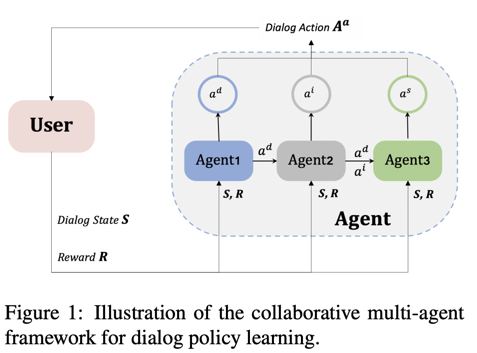

# JOIE: A Collaborative Multi-agent Reinforcement Learning Framework for Dialog Action Decomposition


Research Paper: [JOIE: A Collaborative Multi-agent Reinforcement Learning Approach](https://aclanthology.org/2021.emnlp-main.621.pdf)


## Overview
JOIE (Joint Operation Inference Engine) is an innovative framework designed for dialog action decomposition using a collaborative multi-agent reinforcement learning approach. This repository contains the implementation of the JOIE-3 algorithm, a cornerstone of our research.


## Key Components
### Core Algorithm
* The main implementation of JOIE-3 is located in /JOIE Main/JOIE.py.

### Configuration and Parameters
* For parameter settings, refer to demo.json.
* Action decoder configuration can be found in /JOIE Main/multiwoz_vocab_action_decoder_hrl.py.
* Memory settings are detailed in the ReplayHR3 class within /JOIE Main/replay.py.

### Prerequisites
JOIE is built upon the ConvLab platform. To run JOIE:

1. Install ConvLab: Visit [ConvLab GitHub Repository](https://github.com/ConvLab/ConvLab) for installation instructions.
2. After installing ConvLab, use the following command to execute the JOIE framework:
```
python run.py demo.json rule_wdqn_Co3Jo train
```